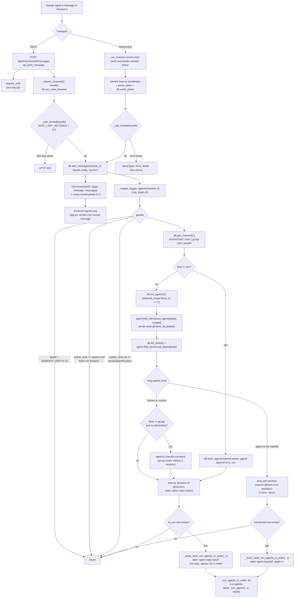

# Architecture

Swarm is a self-hosted team workspace where AI agents are named teammates
in the same channels as people. One FastAPI process owns orchestration;
SQLite is the single durable record; a React build is served from the same
process.

This document describes what the code actually does. Function and module
names are the ones in the repository.

## Runtime shape

```
browser / cli/swarm_cli.py
        │  REST /api/*   and   WS /ws/{channel_id}
        ▼
backend/main.py      routes, auth deps, rate limit, WS Hub, trigger logic
        │
        ├── backend/db.py          chat schema + all CRUD
        ├── backend/work.py        work sessions (the unified event seam)
        ├── backend/v2.py          workflows, runs, run_events, artifacts, OAuth
        ├── backend/agent.py       one agent turn: context -> provider -> tools
        ├── backend/ai_support/    provider catalog, credential store, resolver
        ├── backend/tools/         registry: builtin + custom + plugin tools
        ├── backend/context.py     per-turn context budget assembly
        ├── backend/work_state.py  display state machine over event logs
        └── frontend/dist          static React build, mounted at /
```

Startup is `lifespan()` in `backend/main.py`: `db.init_db()`, `v2.init_db()`,
`work.init_db()`, `knowledge.init_db()`, a sandbox GC sweep, restart of
`v2.recoverable_runs()`, `work.recover_interrupted()`, `tools.system.hydrate_root()`,
`reload_registry()`, then the routine scheduler (`_routine_loop`, 20 s tick)
and the sandbox sweeper (`_gc_loop`, 300 s tick).

## Request flow: a human message that triggers an agent

The same trigger path serves both transports. `POST /api/channels/{id}/messages`
(`api_post_message`) and the WebSocket receive loop in `ws_channel` both
persist the message, broadcast it, and call `_maybe_trigger_agents`.



Note the ordering guarantee: the whole batch is one `asyncio.Task`, and
`_run_agents_in_order` awaits each agent in turn, so multi-mention replies
come back in mention order rather than racing.

### One agent turn

```mermaid
flowchart TD
    RA["_run_agent(channel_id, agent_row, depth)"] --> ARC{"agent_row.archived?"}
    ARC -->|yes| D0[return empty result]
    ARC -->|no| ST["_set_status(name, 'working')<br/>db.set_agent_status +<br/>hub.broadcast_all {type: bot_status}"]
    ST --> TY["hub.broadcast(C, {type: typing, author})"]
    TY --> HIST["window = agent.history_window_of(row)<br/>history = db.get_history(C, limit=max(2w, w))"]
    HIST --> OWN["_work_owner_from_history(history)<br/>-> (owner, objective)"]
    OWN --> WS["work.create_session(owner, objective,<br/>source = routine | handoff | chat)"]
    WS --> EV1["_emit_work_event: work_started,<br/>agent_started<br/>-> work.append_event +<br/>hub.broadcast {type: work}"]
    EV1 --> GEN["agent.generate_reply(row, C, history,<br/>on_tools_ready, on_stream_start,<br/>on_token, delegate_depth=depth)"]

    GEN --> DEMO{"demo_mode_enabled()?"}
    DEMO -->|yes| DM["_demo_generate_reply<br/>deterministic mock, no provider"]
    DEMO -->|no| RES["resolve_effective_model(row.model,<br/>override)"]
    RES --> READY{"ai_support.resolver<br/>any_provider_ready()?"}
    READY -->|no| NOKEY["reply = '[agent error: no API key ...]'"]
    READY -->|yes| CHAIN["iter_provider_attempts(model)<br/>OpenAI-compatible clients in<br/>priority order + anthropic"]

    CHAIN --> TOOLS{"should_offer_tools(history,<br/>channel_kind)?<br/>and agent has allowed tools"}
    TOOLS -->|no| LOOP1["_run_with_client(use_tools=False)"]
    TOOLS -->|yes| LOOP2["_run_with_client(use_tools=True)"]

    LOOP1 --> ROUND
    LOOP2 --> ROUND

    subgraph TOOLLOOP ["_run_with_client tool loop (cap = max_tool_calls_of(row), hard cap 24)"]
        ROUND["_complete_stream(client, model, messages,<br/>stream=True, tools=schemas)"]
        ROUND --> PARSE{"tool_calls returned?"}
        PARSE -->|no| REPLY["return {reply, tool_events, usage}"]
        PARSE -->|yes| EXEC["_execute_tool -> ToolRegistry.execute<br/>(allowed list enforced)<br/>append {tool,args,result} to tool_events"]
        EXEC --> AGAIN["loop again (cap+1 rounds max)"]
        AGAIN --> ROUND
    end

    REPLY --> AUDIT["persist_tools(result.tool_events)<br/>on_tools_ready, once per run"]
    AUDIT --> SYSMSG["for each tool event:<br/>db.add_message(C, name,<br/>'{name} ran: {tool}({args}) -> {result[:200]}',<br/>author_kind='system')<br/>hub.broadcast {type: message}"]
    SYSMSG --> APPR{"event.tool == 'request_approval'?"}
    APPR -->|yes| PEND["db.list_approvals(channel_id, 'pending')<br/>hub.broadcast_all {type: approval}<br/>_emit_work_event approval_requested"]
    APPR -->|no| STREAM
    PEND --> STREAM["on_stream_start -> hub.broadcast<br/>{type: agent_stream_start}"]

    STREAM --> TOK["on_token(delta) per chunk:<br/>hub.broadcast {type: agent_token, author, delta}<br/>buffer capped at 30000 chars"]
    TOK --> FIN["return to _run_agent"]
    NOKEY --> FIN
    DM --> FIN

    FIN --> PERSIST["db.add_message(C, name, reply, 'agent',<br/>model=used_model)<br/>ONE persisted message per turn"]
    PERSIST --> PMB["hub.broadcast(C, {type: message, message})"]
    PMB --> LINK["work.link_message(session, msg.id)<br/>_emit_work_event message_linked"]
    LINK --> ASKED{"any tool == 'request_approval'?"}
    ASKED -->|yes| SNA["_set_status(name, 'needs_approval')<br/>no work_completed event"]
    ASKED -->|no| DONE["_emit_work_event work_completed<br/>(summary + context stats)"]

    SNA --> NEXT
    DONE --> NEXT{"depth < HANDOFF_DEPTH (3)?"}
    NEXT -->|yes| RECUR["_maybe_trigger_agents(C, agent_msg, depth+1)<br/>an @mention in the reply triggers the next bot"]
    NEXT -->|no| ENDRUN[return result]
    RECUR --> ENDRUN

    ENDRUN -.->|"CancelledError"| CUT["partial = ''.join(streamed)<br/>db.add_message(... + CUTOFF_MARKER)<br/>work_cancelled event"]
    ENDRUN -.->|"Exception"| ERR["classify_error(exc) -> '[agent error: ...]'<br/>db.add_message(author_kind='agent')<br/>work_failed event;<br/>never a raw traceback, never a 500"]
```



### Provider resolution

`backend/ai_support/`:

- `providers.py` — priority-ordered catalog of 16 entries: `groq`,
  `openrouter`, `openai`, `huggingface`, `together`, `google`, `mistral`,
  `deepseek`, `xai`, `fireworks`, `perplexity`, `nvidia`, `opencode`, `zen`,
  `anthropic`, `custom`.
- `store.py` — API keys and OAuth tokens are sealed with a XOR over
  `sha256(SWARM_SECRET)` before they touch SQLite. Only `key_hint` is ever
  returned by an API.
- `resolver.py` — `resolve_runtime_auth()` (stored key → env fallback),
  `resolve_effective_model()` (override → `SWARM_AGENT_MODEL` → connected
  provider default → agent row), `iter_provider_attempts()` (ordered
  `(client, model, provider_id)` triples), and a small `_AnthropicClient`
  shim so Anthropic speaks the same `chat.completions.create(stream=True)`
  shape as everything else.
- `build_openai_compatible_client()` uses `openai.AsyncOpenAI` for every
  OpenAI-compatible provider; the `custom` provider reads
  `SWARM_OPENAI_COMPAT_BASE_URL` so Ollama / LM Studio / vLLM need no code
  change.

Inside `generate_reply`, each attempt is made on a *copy* of the message
list, so a failed provider cannot leave half-appended tool turns behind. A
retryable error (`is_retryable`: 429/408/5xx, timeout, rate limit,
connection) gets one retry after `RETRY_DELAY_SECONDS`. If a pinned
`model_override` is gone and the error is model-not-found, `generate_reply`
recurses once with `model_override=None` and tags the result
`model_fallback: True` — already-streamed tokens stay visible and the
fallback continues the same reply. A provider fallback will not announce a
second visible stream (`stream_announced` guard in `generate_reply`).

### Tool dispatch

`backend/agent.py::_execute_tool` delegates to
`backend/tools/registry.py::ToolRegistry.execute(name, args, ...)`:

1. `if name not in allowed` → `(tool {name} is disabled for this agent)`.
2. `BUILTIN_SCHEMAS` → `_exec_builtin`: sandbox file tools, memory and
   knowledge tools, `read_only_shell` via `_run_shell_tool` (cwd = sandbox,
   10 s timeout, minimal PATH), `system_*` tools bound to `SWARM_SYSTEM_ROOT`,
   browser tools, search connectors, `create_agent`, `delegate_task`,
   `request_approval`, `computer_*`.
3. `custom_tools` rows → `_exec_custom` (template handler).
4. Plugin tools loaded from `plugins/*/manifest.json`, keyed
   `plugin:<slug>:<tool>` → `_exec_plugin`.

Schemas offered to the model are built by `ToolRegistry.schemas_for`, and
`ToolRegistry.filter_allowed` drops unknown names from an agent's stored tool
list.

## WebSocket fanout and where streamed tokens are persisted

`class Hub` in `backend/main.py` is an in-memory room map
(`dict[channel_id, set[WebSocket]]`) plus a presence counter per handle. It
holds no history — history is the database's job. `broadcast()` sends to
every socket in the room and evicts the ones that raise.
`broadcast_all()` iterates every room, used for cross-channel frames
(`bot_status`, `approval`, `agents_changed`).

`ws_channel` handshake, in order:

1. `db.get_channel(channel_id)`; missing → close `4004`.
2. `await websocket.accept()`, then **the first frame must be**
   `{"token": "<handle>:<raw>", "last_seen_id": N?}`. Unparseable or
   unverifiable → close `4001`. Not allowed to view the channel → close `4003`.
   The handle is fixed here; clients never set `author` over WS.
3. `hub.join()` + `hub.mark_online(handle)`.
4. If `last_seen_id` was sent, page the whole gap with
   `db.get_history_after()` (up to 20 pages of 200), attaching reactions via
   `_with_reactions`, and send each as `{"type": "message", ...}`.

Frame types the server emits (verified against `frontend/src/App.jsx`):

| Frame | Emitted by | Carries |
| --- | --- | --- |
| `message` | many | the persisted message row |
| `typing` | `_run_agent` | `author` |
| `agent_stream_start` | `on_stream_start` | `author` |
| `agent_token` | `on_token` | `author`, `delta` |
| `bot_status` | `_set_status`, approval resolve | `name`, `status` |
| `work` | `_emit_work_event` | one `work_events` row |
| `approval` | tool persistence, approval resolve | approval row |
| `agents_changed` | `create_agent` tool result | — |
| `message_deleted`, `channel_deleted`, `reaction`, `reaction_removed`, `agents_changed` | REST handlers | deltas |
| `error` | WS receive loop | `detail` |

**Where streamed tokens are persisted: nowhere, until the turn ends.**
`_complete_stream` forwards each delta to `on_token` → `hub.broadcast` as
`agent_token`, and `_run_agent` accumulates them in the local `streamed`
list only. Exactly one `messages` row per agent turn is written at the end
of `generate_reply`, by `db.add_message(channel_id, name, result["reply"],
"agent", model=...)`. The three persistence paths are:

- **Normal completion** — one `author_kind='agent'` row holding the full reply.
- **Cancellation** (`POST /api/channels/{id}/stop` → `_stop_channel_tasks`
  cancels the task): `streamed` text is joined and written as an
  `author_kind='agent'` row with `agent.CUTOFF_MARKER`
  (`[reply cut off — stopped]`) appended, plus a `work_cancelled` event.
- **Mid-stream provider failure** inside `_complete_stream`: partial content
  is returned with `agent.CUTOFF_NOTE` (`\n\n[reply cut off]`) appended rather
  than raising.

Tool calls are persisted *before* the reply: `persist_tools()` is invoked via
`on_tools_ready` before the first streamed token, and again after
`generate_reply` returns — it is idempotent (`tools_posted` flag). Each tool
event becomes a `system` message in the same channel. These system rows are
visible audit, and `_build_messages` skips `author_kind == "system"` when
assembling model context, so the audit trail is for humans without re-entering
the model's own prompt.

`/api/v2/ws/runs/{run_id}` is a separate, polling socket for durable
workflow runs: it verifies the token, then polls `v2.list_events()` every
0.75 s and closes with `run_terminal` when the run reaches a terminal status.

## Data model

One SQLite file at `SWARM_DB_PATH` (`/app/data/swarm.db` in Docker). No ORM:
`backend/db.py` is a thin async wrapper. Schema lives in three module-level
`SCHEMA` constants plus `ensure_schema()`.

- `db.py` `SCHEMA` + `_ensure_schema()` — the chat core; additive only, via
  `PRAGMA table_info` + `ALTER TABLE`.
- `v2.py` `SCHEMA` + `init_db()` — workflows/runs plus an `ALTER TABLE` that
  adds `ai_providers.auth_method`, `ai_providers.refresh_secret`,
  `ai_providers.expires_at`, and `runs.model`.
- `work.py` `SCHEMA`, `knowledge.py` `SCHEMA` (+ an FTS5 virtual table and
  sync triggers, with a LIKE fallback when FTS5 is unavailable),
  `memory_graph.py` `SCHEMA` (**created lazily on first use**, not at startup).

```mermaid
erDiagram
    channels ||--o{ messages : "channel_id"
    channels ||--o{ channel_members : "channel_id"
    channels ||--o{ channel_people : "channel_id"
    messages ||--o{ messages : "parent_id (thread)"
    messages ||--o{ reactions : "message_id"
    messages ||--o{ work_message_links : "message_id (no FK)"
    channels ||--o{ approvals : "channel_id (no FK)"
    channels ||--o{ agent_memory : "channel_id, nullable = global"
    channels ||--o{ knowledge_docs : "channel_id, nullable"
    agents ||--o{ agent_memory : "agent_name (no FK)"
    agents ||--o{ channel_members : "agent_name (no FK)"
    agents ||--o{ agent_team_members : "agent_name (no FK)"
    agent_teams ||--o{ agent_team_members : "team_id (no FK)"
    agents ||--o{ routine_runs : "via routines.agent_name"
    routines ||--o{ routine_runs : "routine_id FK"
    agents ||--o{ work_sessions : "via channel_id"
    work_sessions ||--o{ work_events : "work_id FK"
    work_sessions ||--o{ work_message_links : "work_id FK"
    workflows ||--o{ runs : "workflow_id FK"
    runs ||--o{ run_events : "run_id FK"
    runs ||--o{ run_artifacts : "run_id FK"
    work_sessions }o--o| runs : "run_id (no FK)"

    channels {
        TEXT id PK
        TEXT name UK
        TEXT topic
        REAL created_at
        TEXT kind "room|group|dm|people"
        TEXT owner_agent "set when kind=dm"
    }
    messages {
        INTEGER id PK
        TEXT channel_id FK
        INTEGER parent_id FK
        TEXT author "handle or agent name"
        TEXT author_kind "human|agent|system"
        TEXT body
        REAL created_at
        TEXT model "model id that produced an agent reply"
    }
    users {
        TEXT handle PK
        TEXT token_hash "sha256 of the raw token"
        REAL created_at
        TEXT role "admin|member"
        TEXT password_hash "pbkdf2"
    }
    agents {
        TEXT name PK
        TEXT system_prompt
        TEXT model
        TEXT channel_scope "NULL = all channels"
        REAL created_at
        INTEGER history_window "default 12"
        INTEGER max_tool_calls "default 6"
        TEXT tools "JSON array of tool names"
        TEXT job
        TEXT status "idle|working|needs_approval"
        TEXT display_name
        TEXT avatar
        REAL archived_at
        INTEGER tools_locked
    }
    channel_members {
        TEXT channel_id PK
        TEXT agent_name PK
        INTEGER sort_order
    }
    channel_people {
        TEXT channel_id PK
        TEXT handle PK
    }
    agent_teams {
        TEXT id PK
        TEXT name
        TEXT description
        REAL created_at
    }
    agent_team_members {
        TEXT team_id PK
        TEXT agent_name PK
        INTEGER sort_order
    }
    agent_memory {
        INTEGER id PK
        TEXT agent_name
        TEXT channel_id "NULL = global"
        TEXT kind "note|summary"
        TEXT body
        REAL created_at
        REAL updated_at
    }
    skills {
        INTEGER id PK
        TEXT name UK
        TEXT body
        REAL created_at
        REAL updated_at
    }
    routines {
        INTEGER id PK
        TEXT agent_name
        TEXT title
        TEXT instructions
        INTEGER interval_minutes
        INTEGER enabled
        REAL last_run_at
        REAL next_run_at
        REAL created_at
    }
    routine_runs {
        INTEGER id PK
        INTEGER routine_id FK
        REAL started_at
        REAL finished_at
        TEXT status
        TEXT excerpt
    }
    approvals {
        INTEGER id PK
        TEXT agent_name
        TEXT channel_id
        TEXT action
        TEXT detail
        TEXT status "pending|approved|denied"
        REAL created_at
        REAL resolved_at
    }
    reactions {
        INTEGER message_id PK
        TEXT author PK
        TEXT emoji PK
        REAL created_at
    }
    custom_tools {
        INTEGER id PK
        TEXT name UK
        TEXT description
        TEXT parameters "JSON schema"
        TEXT handler_type "template"
        TEXT handler_config "JSON"
        INTEGER enabled
        REAL created_at
        REAL updated_at
    }
    ai_providers {
        TEXT provider_id PK
        TEXT secret "sealed, never returned by an API"
        TEXT key_hint
        TEXT model
        REAL connected_at
        TEXT auth_method "added by v2.init_db"
        TEXT refresh_secret "added by v2.init_db"
        REAL expires_at "added by v2.init_db"
    }
    workspace_meta {
        TEXT key PK
        TEXT value
    }
    work_sessions {
        TEXT id PK
        TEXT owner
        TEXT source "chat|routine|handoff|run"
        TEXT status
        TEXT objective
        TEXT channel_id
        INTEGER root_message_id
        TEXT run_id
        TEXT active_step
        TEXT summary
        INTEGER requires_action
        REAL created_at
        REAL started_at
        REAL finished_at
    }
    work_events {
        INTEGER id PK
        TEXT work_id FK
        INTEGER seq "unique per work_id"
        TEXT type
        TEXT step_id
        TEXT payload "JSON, sensitive keys stripped"
        REAL created_at
    }
    work_message_links {
        TEXT work_id PK
        INTEGER message_id "PK"
    }
    workflows {
        TEXT id PK
        TEXT owner
        TEXT name
        TEXT description
        TEXT graph "JSON nodes+edges"
        REAL created_at
        REAL updated_at
        REAL archived_at
    }
    runs {
        TEXT id PK
        TEXT workflow_id FK
        TEXT owner
        TEXT objective
        TEXT status
        TEXT policy
        TEXT report "JSON"
        TEXT model "added by v2.init_db"
        REAL created_at
        REAL started_at
        REAL finished_at
    }
    run_events {
        INTEGER id PK
        TEXT run_id FK
        INTEGER seq "unique per run_id"
        TEXT event_type
        TEXT step_id
        TEXT payload "JSON"
        REAL created_at
    }
    run_artifacts {
        TEXT id PK
        TEXT run_id FK
        TEXT step_id
        TEXT name
        TEXT uri
        TEXT mime_type
        TEXT metadata "JSON"
        REAL created_at
    }
    knowledge_docs {
        TEXT id PK
        TEXT owner "'agent:swarm' or a handle"
        TEXT channel_id
        TEXT title
        TEXT body
        TEXT tags
        TEXT source "manual|agent"
        REAL created_at
        REAL updated_at
    }
    memory_meta {
        INTEGER memory_id PK
        TEXT source
        REAL confidence
        TEXT scope
        TEXT owner
        TEXT sensitivity
        REAL created_at
        REAL last_confirmed
    }
    knowledge_relations {
        INTEGER id PK
        TEXT src
        TEXT rel
        TEXT dst
        TEXT metadata "JSON"
        REAL created_at
    }
```



Entity notes worth knowing before reading the code:

- **`channels.kind`** is a four-way union and most behavior branches on it:
  `room` (shared, mention-gated), `group` (shared, roster hears every
  message when nobody is `@`-mentioned), `dm` (`owner_agent` set; that bot
  answers everything, no mention needed; id is `dm-<agent>`), `people`
  (human↔human; id is `people-<a>-<b>`, sorted; visible only to its two
  participants per `can_view_channel`).
- **`agents.channel_scope`** scopes which channels an agent can be mentioned
  in; `NULL` means all channels.
- **`messages.author_kind`** is the identity model: one table for humans,
  agents, and system audit rows. A tool call is a `system` row whose body is
  `{agent} ran: {tool}({args}) -> {result}`; a routine tick is a `system` row
  prefixed `[routine:`; an approval resolution is a `human` row.
- **`messages.model`** records which model actually produced an agent reply,
  including after a `model_fallback`.
- **`ai_providers.secret`** is sealed, not hashed. `key_hint` is a
  last-four hint. No endpoint returns the secret.
- **`work_events`** is the unified seam. `work.py` maps v2 run events onto
  work event types at read time (`run_started` → `work_started`,
  `step_completed` → `tool_finished`, …) and numbers them after the session's
  own high-water mark so a cursor poll never renumbers or re-delivers.
  `work_state.derive_state()` folds either event log into one display state
  using an explicit transition table; `summarize_progress()` reshapes the log
  into plan / current step / evidence / decisions / failures.
- **`knowledge_docs`** is FTS5-backed with `LIKE` fallback, and channel-scoped
  hits are boosted in `context.build_context()` so they survive the character
  budget longest.
- **`memory_meta` / `knowledge_relations`** are created on first write by
  `memory_graph.init_tables()`, so they do not exist in a freshly initialized
  database until something calls `add_relation()` or `save_memory_meta()`.

## Per-turn context assembly

`backend/context.py::build_context()` builds the package
`generate_reply` turns into a prompt:

1. Drop `system` rows, keep the last `window` messages.
2. `db.get_context_memories(agent, channel, 12)` → notes plus the channel summary.
3. `knowledge.search_docs()` keyed on the last human message (or an explicit
   `kb_query`), scoped to `owner="agent:<name>"`; channel-scoped hits get
   `boosted=True` and sort first.
4. Enforce `BUDGET_CHARS` by dropping, in order: unboosted KB hits, then
   boosted hits, then notes, then oldest history.

`_build_messages` then concatenates blocks into one `system` message: the
agent's `system_prompt`, the tool policy (with display name, job, and the
allowed tool list), `profile.md` if one exists for the job, a group-chat
roster line, the saved-skill index and any `/slash-skill` invoked from the
triggering message, tool-conditional habits (`knowledge_search`/`knowledge_save`,
`forget`), the notes, the channel summary, and the top KB hits. History is
appended as `user` / `assistant` turns with `"{author}: "` prefixes on human
messages.

## Approval flow

The agent asks by calling the `request_approval` builtin, which
(`agent._run_approval_tool`) writes an `approvals` row with status `pending`
and sets the agent's status to `needs_approval`. The tool result tells the
model to stop and not proceed. `_run_agent` then surfaces the row:
`hub.broadcast_all({"type": "approval", ...})` and a `approval_requested`
work event. No `work_completed` is emitted while an approval is pending.

A human resolves it at `POST /api/approvals/{id}/resolve`. That handler
returns `409` if already resolved, resets the agent status to `idle`
(broadcast to all), and posts a **`human`** message into the original channel:
`"Approved: {action} — {detail}. Continue from here."` or
`"Denied: {action} — {detail}. Do not proceed with that action."` Then it
emits `approval_resolved` on any waiting session and calls
`_maybe_trigger_agents` so the bot reads its own verdict in-channel and
continues.

## Multi-bot paths

- **Handoff.** A bot replies with an `@mention` of another bot. After the
  reply is persisted, `_run_agent` re-enters `_maybe_trigger_agents` with
  `depth+1` when `depth < HANDOFF_DEPTH` (3). On that path `author_kind ==
  "agent"` drops the self-mention, expands any `@team-id` into that team's
  members, and if nothing is mentioned returns without running anything.
- **Delegation.** The `delegate_task` tool calls
  `agent.generate_delegate_reply()`, which runs the target headlessly: no
  streaming, no channel post, tools forced on, an appended
  `[delegated task from @parent]` turn, and `create_agent`/`request_approval`
  excluded. `DELEGATE_DEPTH_CAP` is 2; at the cap `delegate_task` is also
  excluded. Failures return as text so the parent turn never crashes.
- **Routines.** `_routine_loop` → `run_due_routines()` → `_execute_routine()`
  writes a `system` message prefixed `[routine:` into the bot's own
  `dm-<name>` channel and calls `_run_agent(source="routine")`, then records a
  `routine_runs` row. Max 50 routines per bot. A concurrent run of the same
  routine is skipped via the `_active_routines` set.
- **Durable workflows (v2).** `POST /api/v2/runs/{id}/start` →
  `v2.start_run` → `execute_run` orders the graph with `order_nodes()`
  (topological), skips already-`step_completed` and already-approved steps,
  fans out `parallel` nodes with `asyncio.gather`, and halts at an `approval`
  node with `waiting_for_approval`. Each step calls the *same*
  `agent.generate_reply` with a synthetic `run-{run_id}` channel and a
  one-message history. The run finishes by writing a `run-report.json`
  artifact. `recoverable_runs()` restarts unfinished runs at startup.

## Perimeter, stated honestly

- The shell sandbox is a working directory plus a timeout plus a minimal
  PATH — **not** container or network isolation. Host-system tools
  (`system_ls`, `system_read`, `system_write`, `system_run`) are bound to
  `SWARM_SYSTEM_ROOT`.
- `_rate_limited` is a 500 ms per-handle minimum gap between writes, held in
  a process-local dict. It is not a quota and not multi-process.
- Langfuse tracing is best-effort and silent when
  `LANGFUSE_PUBLIC_KEY`/`LANGFUSE_SECRET_KEY` are unset.
- `backend/routing.py`, `backend/policy.py`, `backend/evals.py`, and
  `backend/work_state.py` are reached from `/api/v2/*` routes and the work
  view. They do not sit in the chat request path: `_run_agent` does not call
  `policy.evaluate` or `routing.route`. The only approval gate on the chat
  path is the agent calling `request_approval` itself.